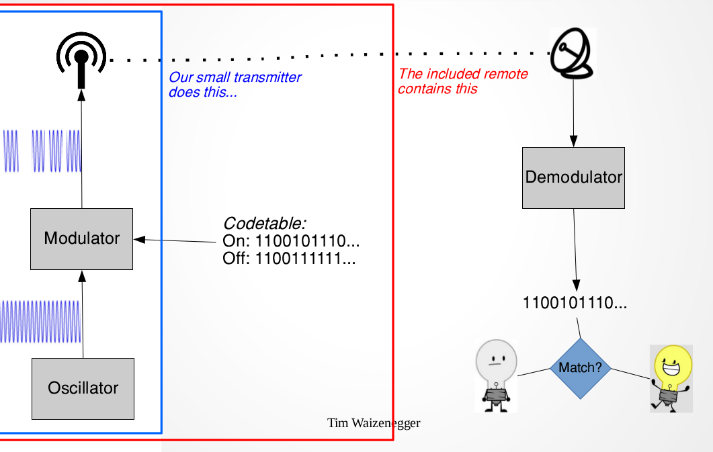
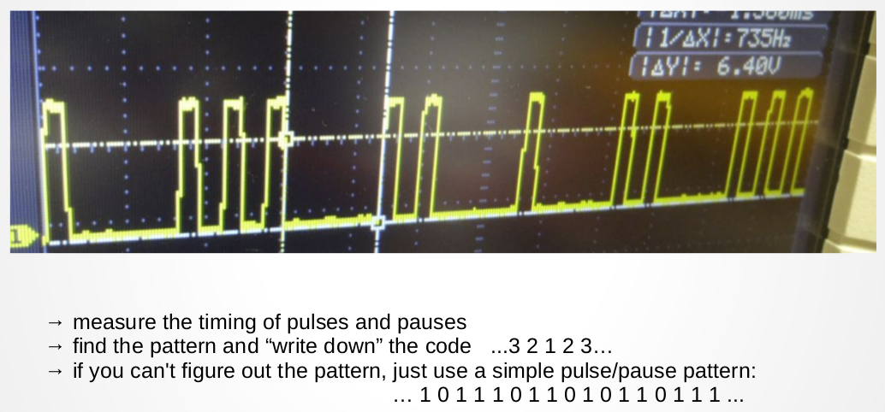
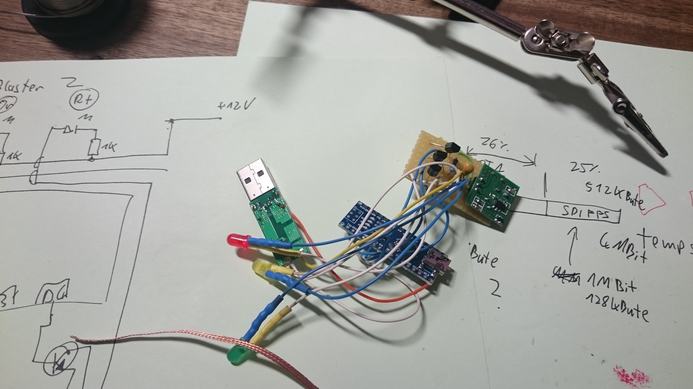
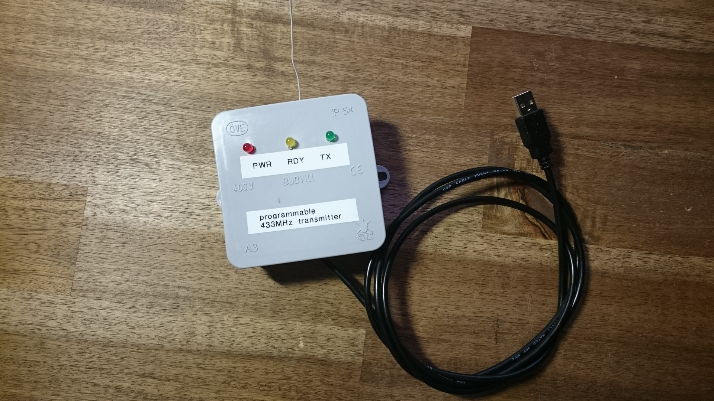
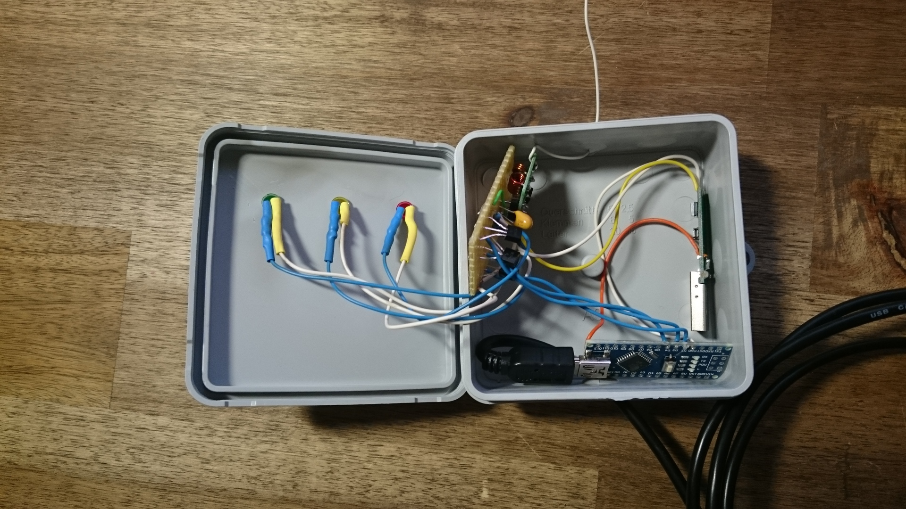
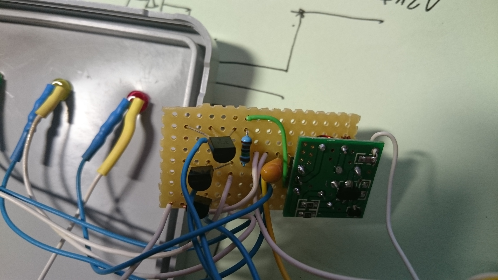
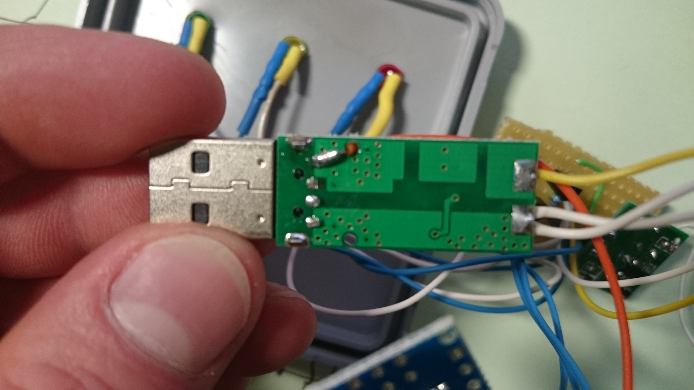
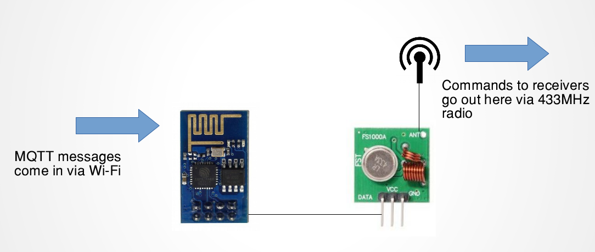
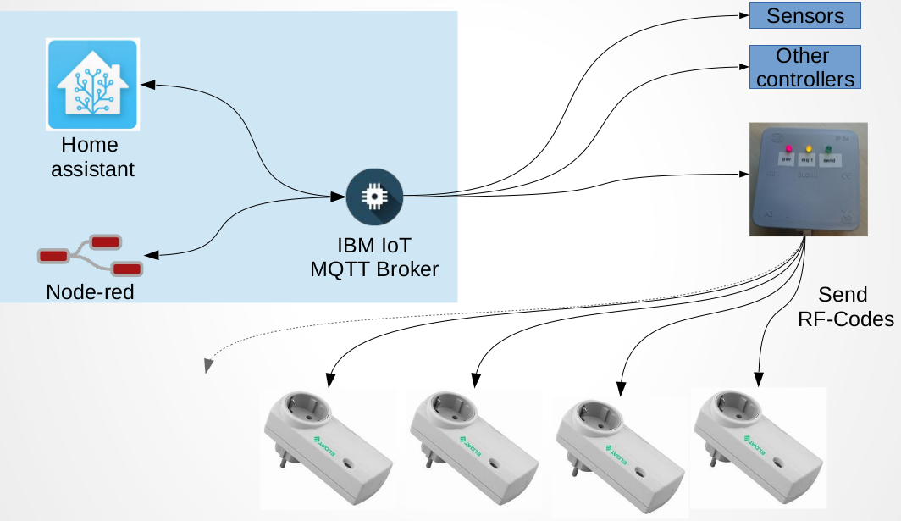

# rfblaster
This repo contains arduino code and some instructions for building a programmable 433MHz transmitter for IoT/Smarthome applications.

The cheapest and most widely available smarthome devices are plug receivers, light socket, switches, ... that all use 433MHz (or 866MHz). 
They usually have a small remote control that sends some simple code that the devices recognize. It's one-way communication based on matching a preset code pattern.
The rfblaster can send most/arbitrary codes but it's up to you to implement the codes for the devices you use. 

## Where to get the rf codes?
Check the slides for more infos: [doc/04-smarthome.pdf](doc/04-smarthome.pdf)

the source includes some codes for 3 different receiver brands that I own. You can try those first. I found the following works well for figuring out new codes: 

* connect a (digital storage) oscilloscope to the antenna of the remote for your receivers and record the signal. 
* alternative: you can use a 433MHz receiver (usually included with the transmitters you need; see slides) and record it's output with a signal analyzer; even GPIO input of an arduino should work. Getting the timing right is more difficult this way though.
* Write down the code... They are very short and you can clearly see how 1/0 are transmitted.
* implement methods for sending 1 and 0 (some use ternary codes; 0, 1 and 2)
* save the code as 0/1/(2) sequences and generate the whole signal with the correct timing

## Warning
The rf transmitters I used destroy themselves when they are continuously transmitting a "1". Their DATA pin must not be high all the time; but only pulsed to send a signal. In the hardware design here, this has to be done by the arduino. It's GPIO has to be high so that the transistor pulls down the DATA pin. If the arduino GPIO is low or floating for a long period, the transmitter will get damaged.

A better design would use PNP transistors so that the transmitter would be off in the down/floating state of arduino GPIO and only on then the GPIO is high.

## Versions
* [rfblaster-usb](rfblaster-usb/) uses an arduino and is controlled by RS232 (serial) commands via USB 
* [rfblaster-mqtt](rfblaster-mqtt/) uses an ESP8266 wifi module and connects to an mqtt broker to receive commands

# rfblaster USB
This device uses 3 off-the-shelve modules and a few components:
* Arduino nano
* 5V->12V DC/DC converter (looks like a USB-drive in the images)
* 433MHz transmitter module (see slides for name/link). This requires the 12V from the converter for a strong enough signal
* 3 BC547 BJT NPN transistors. these are directly controlled by arduino GPIOs and drive 2 LEDs and the rf-signal. other NPN transistors should be ok too.
* 3 1k resistors for the LEDs; they are connected to the 12V from the converter
* 1 2k pull-up resistor for the rf-signal in. this pulls the DATA line of the transmitter high; the third transistor pulls this low to create a 0-12V data signal
* 1 20µF capacitor for the 12V output of the converter. Maybe not needed, other values should be fine too.

# rfblaster MQTT

